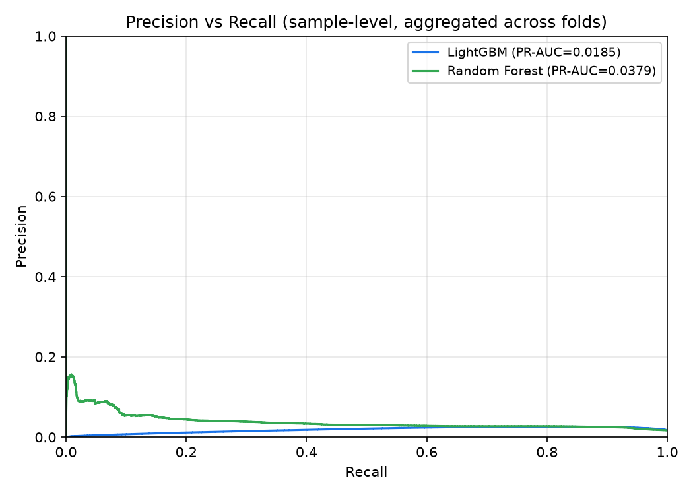

# SPARC Model Evaluation Report

## 1. Overview and Protocol

- Validation: GroupKFold by race (5 splits across 15 Grand Prix)
- Races: 15 (2026_Baku_Race, 2026_Catalunya_Race, 2026_Hungaroring_Race, 2026_Madring_Race, 2026_Melbourne_Race, 2026_Miami_Race, 2026_Monte_Carlo_Race, 2026_Montreal_Race, 2026_Monza_Race, 2026_Shanghai_Race, 2026_Silverstone_Race, 2026_Spa-Francorchamps_Race, 2026_Spielberg_Race, 2026_Suzuka_Race, 2026_Zandvoort_Race)
- Target: clip event begins within the next 300 m and car is not currently clipping
- Alert debouncing: at most one alert per straight (cooldown until next braking zone)
- Decision threshold: 0.50 (unless otherwise noted)

## 2. Data Prevalence

| Race | Total Samples | Positive Samples | Prevalence (%) | Clip Events |
|---|---|---|---|---|
| 2026_Baku_Race | 573,628 | 3,555 | 0.62 | 228 |
| 2026_Catalunya_Race | 527,428 | 44 | 0.01 | 4 |
| 2026_Hungaroring_Race | 561,176 | 4,466 | 0.80 | 278 |
| 2026_Madring_Race | 565,378 | 4,555 | 0.81 | 280 |
| 2026_Melbourne_Race | 467,918 | 8,681 | 1.86 | 686 |
| 2026_Miami_Race | 541,750 | 5,859 | 1.08 | 499 |
| 2026_Monte_Carlo_Race | 633,578 | 563 | 0.09 | 25 |
| 2026_Montreal_Race | 542,146 | 7,636 | 1.41 | 561 |
| 2026_Monza_Race | 633,556 | 15,481 | 2.44 | 1099 |
| 2026_Shanghai_Race | 527,450 | 8,536 | 1.62 | 530 |
| 2026_Silverstone_Race | 523,886 | 19,479 | 3.72 | 1470 |
| 2026_Spa-Francorchamps_Race | 485,958 | 20,890 | 4.30 | 1679 |
| 2026_Spielberg_Race | 502,282 | 5,888 | 1.17 | 412 |
| 2026_Suzuka_Race | 562,980 | 17,546 | 3.12 | 1327 |
| 2026_Zandvoort_Race | 633,578 | 14,449 | 2.28 | 982 |
| **Total** | **8,282,692** | **137,628** | **1.66** | **10060** |

## 3. Gate 3: Estimated SoC Separation per Team

Mean estimated SoC in the 300 m before observed clips versus all other samples.

| Team | Pre-Clip SoC (%) | Elsewhere SoC (%) | Gap (pts) |
|---|---|---|---|
| Alpine | 6.04 | 59.62 | 53.58 |
| Aston Martin | 15.12 | 77.19 | 62.07 |
| Audi | 5.73 | 60.37 | 54.65 |
| Cadillac | 3.05 | 62.59 | 59.54 |
| Ferrari | 2.90 | 54.14 | 51.25 |
| Haas F1 Team | 4.20 | 54.99 | 50.79 |
| McLaren | 6.40 | 62.35 | 55.96 |
| Mercedes | 5.59 | 61.92 | 56.33 |
| Racing Bulls | 6.93 | 60.79 | 53.86 |
| Red Bull Racing | 3.79 | 59.60 | 55.80 |
| Williams | 7.11 | 63.75 | 56.63 |

## 4. Model Performance (debounced, event-level, threshold = 0.50)

Mean +/- std across 5 folds.

| Model | PR-AUC | Event Precision | Event Recall | Mean Lead (m) | Median Lead (m) | FA / lap-driver |
|---|---|---|---|---|---|---|
| Threshold (SoC<25%) | 0.0518 +/- 0.0165 | 0.0234 +/- 0.0115 | 0.2510 +/- 0.1501 | 207.7 +/- 31.5 | 220.1 +/- 32.0 | 5.72 +/- 0.95 |
| Logistic Regression | 0.0389 +/- 0.0178 | 0.0629 +/- 0.0494 | 0.3214 +/- 0.1328 | 191.5 +/- 23.7 | 210.4 +/- 32.4 | 3.24 +/- 1.07 |
| Random Forest | 0.0716 +/- 0.0597 | 0.0723 +/- 0.0198 | 0.2393 +/- 0.0622 | 214.1 +/- 16.1 | 232.6 +/- 24.1 | 1.80 +/- 0.59 |
| LightGBM | 0.0181 +/- 0.0057 | 0.1115 +/- 0.0471 | 0.3288 +/- 0.1218 | 203.3 +/- 11.7 | 215.8 +/- 14.3 | 1.51 +/- 0.37 |

## 5. LightGBM Per-Fold Metrics

| Fold | PR-AUC | Event Precision | Event Recall | Mean Lead (m) | Median Lead (m) | FA / lap-driver |
|---|---|---|---|---|---|---|
| Fold 1 | 0.0267 | 0.1719 | 0.3747 | 203.6 | 227.3 | 1.78 |
| Fold 2 | 0.0100 | 0.0907 | 0.4912 | 207.6 | 202.9 | 1.34 |
| Fold 3 | 0.0214 | 0.0494 | 0.1483 | 180.8 | 194.6 | 2.03 |
| Fold 4 | 0.0181 | 0.0846 | 0.2348 | 211.3 | 230.2 | 1.42 |
| Fold 5 | 0.0145 | 0.1608 | 0.3948 | 213.1 | 224.0 | 0.96 |

## 6. Operating Point (target: FA <= 1.0 per lap per driver, LightGBM)

Threshold chosen per fold to achieve at most 1 false alarm per lap per driver.

| Fold | Threshold | Event Recall | FA / lap-driver |
|---|---|---|---|
| Fold 1 | 0.80 | 0.3250 | 0.882 |
| Fold 2 | 0.60 | 0.4943 | 0.963 |
| Fold 3 | 0.75 | 0.1475 | 0.949 |
| Fold 4 | 0.75 | 0.2100 | 0.911 |
| Fold 5 | 0.50 | 0.3948 | 0.959 |
| **Mean** | **0.68** | **0.3143** | **0.933** |

## 7. Feature Ablation Study (LightGBM, event-level)

| Configuration | PR-AUC | Event Precision | Event Recall | Mean Lead (m) | FA / lap-driver | PR-AUC Impact |
|---|---|---|---|---|---|---|
| LightGBM (Full) | 0.0181 +/- 0.0057 | 0.1115 +/- 0.0471 | 0.3288 +/- 0.1218 | 203.3 +/- 11.7 | 1.51 +/- 0.37 | Baseline |
| without p_rival | 0.0193 +/- 0.0061 | 0.0837 +/- 0.0269 | 0.2840 +/- 0.0873 | 201.5 +/- 22.2 | 1.77 +/- 0.44 | +0.0011 |
| without fuel_load_est_kg | 0.0191 +/- 0.0063 | 0.0854 +/- 0.0257 | 0.2892 +/- 0.0951 | 205.8 +/- 18.4 | 1.75 +/- 0.46 | +0.0009 |
| without tyre_age | 0.0193 +/- 0.0062 | 0.0885 +/- 0.0274 | 0.3028 +/- 0.0811 | 205.0 +/- 19.3 | 1.79 +/- 0.44 | +0.0011 |

## 8. Precision vs Recall Curve

## 9. Clip Sample Plots

10 clips detected early (hits) and 10 clips missed, saved to `ml/reports/clip_samples/`:

- Hit 1: `clip_samples/eval_hit_01.png` | Miss 1: `clip_samples/eval_miss_01.png`
- Hit 2: `clip_samples/eval_hit_02.png` | Miss 2: `clip_samples/eval_miss_02.png`
- Hit 3: `clip_samples/eval_hit_03.png` | Miss 3: `clip_samples/eval_miss_03.png`
- Hit 4: `clip_samples/eval_hit_04.png` | Miss 4: `clip_samples/eval_miss_04.png`
- Hit 5: `clip_samples/eval_hit_05.png` | Miss 5: `clip_samples/eval_miss_05.png`
- Hit 6: `clip_samples/eval_hit_06.png` | Miss 6: `clip_samples/eval_miss_06.png`
- Hit 7: `clip_samples/eval_hit_07.png` | Miss 7: `clip_samples/eval_miss_07.png`
- Hit 8: `clip_samples/eval_hit_08.png` | Miss 8: `clip_samples/eval_miss_08.png`
- Hit 9: `clip_samples/eval_hit_09.png` | Miss 9: `clip_samples/eval_miss_09.png`
- Hit 10: `clip_samples/eval_hit_10.png` | Miss 10: `clip_samples/eval_miss_10.png`

## 10. Runtimes per Pipeline Stage

| Stage | Description | Runtime | Status |
|---|---|---|---|
| Stage 1 | OpenF1 Telemetry Processing (15 races) | ~36 s | PASS (Gate 1) |
| Stage 2 | Clipping Detection and Label Construction | ~33 s | PASS (Gate 2) |
| Stage 3 | Energy Engine Calibration (11 teams) | ~66 s | PASS (Gate 3) |
| Stage 4 | Feature Engineering and Model Evaluation | 586.6 s | PASS (Gate 4) |

## 11. Known Limitations

1. Telemetry granularity: public OpenF1 data is sampled at approximately 4 Hz; higher frequency (20-50 Hz) would enable more precise derivative smoothing and tighter lead-time estimates.
2. Top speed drag thresholds: aero setup variations (low downforce Monza vs high downforce Monaco) influence the boundary between clipping and drag saturation.
3. Traffic and slipstream effects: tows and dirty air in close racing alter the effective vehicle envelope and speed slope.
4. Provisional constants: FIA 2026 regulations are in transition, so battery capacity and sensitivities are fitted parameters rather than official team data.
5. Event-level lead time depends on the 4 Hz sampling resolution, which limits precision to approximately 15-20 m per time step at race speed.